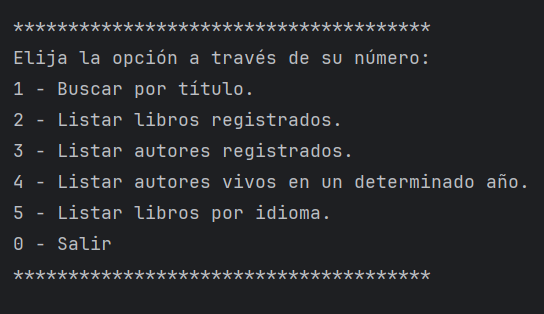

# Literatura

## Descripción

Esta es una aplicación de consola desarrollada en Java 17 que permite buscar libros utilizando la API de [Gutendex](https://gutendex.com/). 
La aplicación usa PostgreSQL 15.3 como base de datos y se puede ejecutar fácilmente usando Docker Compose.

## Requisitos

- Java 17
- Docker

## Instalación

## Ejemplo de Uso

